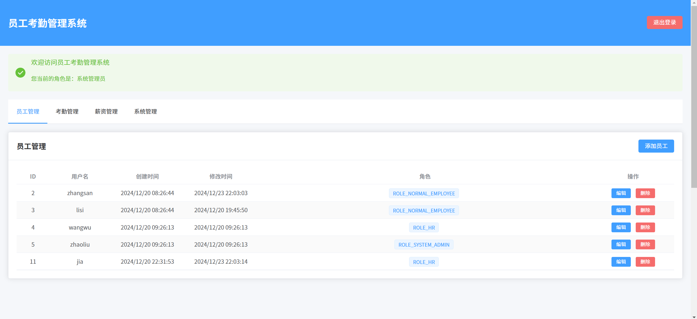
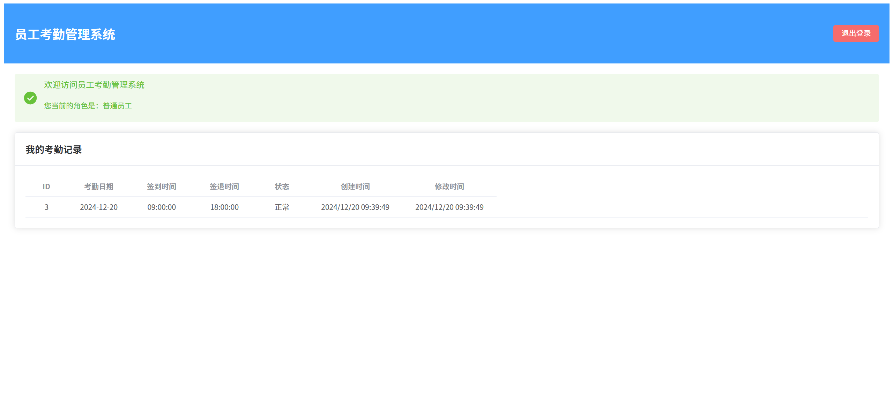

# SpringBoot员工管理系统

## 项目介绍

这是一个基于Spring Boot开发的员工管理系统，集成了Spring Security进行安全认证，实现了用户管理、角色权限、考勤管理、薪资管理等功能。

## 技术栈

- Spring Boot
- Spring Security
- Spring Data JPA
- MySQL
- Hibernate
- Maven

## 功能特性

1. 用户管理
   - 用户注册
   - 用户登录
   - 用户信息管理
2. 角色权限管理
   - 角色分配
   - 权限控制
   - 权限分配
3. 考勤管理
   - 考勤记录
   - 考勤统计
4. 薪资管理
   - 薪资计算
   - 薪资发放记录

## 快速开始

### 环境要求

- JDK 1.8+
- Maven 3.0+
- MySQL 5.7+

### 数据库配置

1. 创建数据库：

```sql
CREATE DATABASE employee_management;
```

2. 在 `application.yml`中配置数据库连接：

```yaml
spring:
  datasource:
    url: jdbc:mysql://localhost:3306/employee_management?useUnicode=true&characterEncoding=utf-8
    username: root
    password: your_password
```

### 运行应用

1. 克隆项目到本地
2. 执行数据库脚本（见 `database/init.sql`）
3. 修改数据库配置
4. 运行以下命令：

```bash
mvn spring-boot:run
```

## 项目结构

```
src/main/java/cn/example/springboot/springbootemployeemanagement/
├── config/         # 配置类
├── controller/     # 控制器
├── entity/         # 实体类
├── repository/     # 数据访问层
├── service/        # 业务逻辑层
└── vo/            # 数据传输对象
```

## 实体关系

- User（用户）
- Role（角色）
- Permission（权限）
- UserRole（用户角色关联）
- RolePermission（角色权限关联）
- Attendance（考勤记录）
- Salary（薪资记录）

## 网页前端展示







## 注意事项

1. 首次运行时，系统会自动创建必要的数据表
2. 默认用户名和密码请参考数据库初始化脚本
3. 建议在生产环境中修改默认的安全配置
